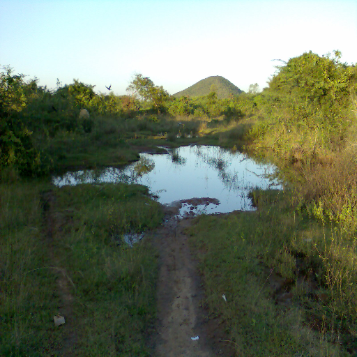
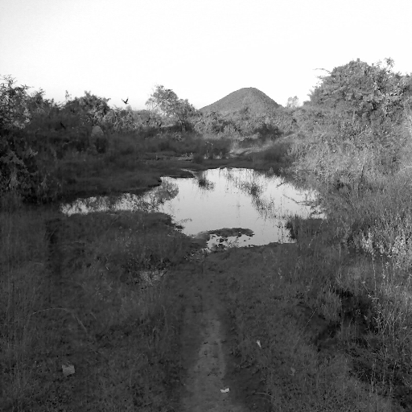

# Water Body Pixel Subsetting and Image Restoration

## Overview
This repository hosts an image processing project focused on subsetting a water body region and applying restoration techniques.  
The primary goal is to perform an 8x8 pixel subset of the water body area, extract a specific image band, simulate image degradation by applying a blur effect, and then restore the image using Gaussian smoothing.

The project demonstrates basic image manipulation and filtering operations, highlighting the effects of blur and the use of smoothing filters for restoration.

## Dataset
**Natural Water Body Image**

The dataset used for this project includes:
- A landscape image containing a water body surrounded by greenery.

## Tasks Performed
The project covers the following steps:

1. **Subset Extraction**  
   An 8x8 pixel subset is selected specifically from the water body area.

2. **Green Channel Extraction**  
   The second band (green channel) of the subset is extracted and displayed separately.

3. **Image Blurring**  
   A blurring operation is applied to simulate degradation of the extracted subset.

4. **Image Restoration**  
   A Gaussian smoothing filter is applied to restore the blurred image to its near-original form.

## Usage
To run the code and reproduce the results:

Clone this repository:

```bash
git clone https://github.com/yourusername/water-body-image-processing.git
cd water-body-image-processing
```

Install the required libraries:

```bash
pip install numpy opencv-python matplotlib
```

Run the main script:

```bash
python main.py
```

The output images will be saved in the working directory.

## Results

### Original Image


### 8x8 Subset


### Green Channel Extraction


### Blurred Image


### Restored Image


The project outputs demonstrate:
- The extracted green channel visualization.
- The effects of blurring on a small image subset.
- The successful restoration of the degraded image using Gaussian smoothing.

## Contributing
If you would like to contribute to this project:

- Fork the repository.
- Create a new branch for your feature or bug fix.
- Make your changes.
- Submit a pull request.
